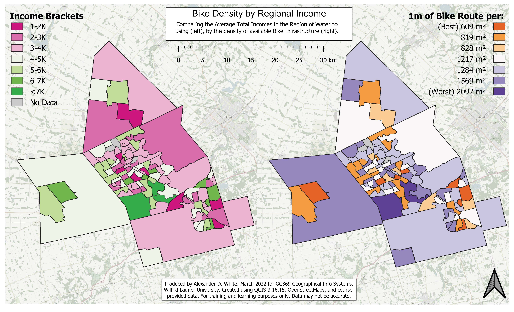

# GG369 - Final Project

## Project Description 

This post is part of the _WLU-GIS_ collection, containing the GIS projects I completed while getting my undergrad at Wilfrid Laurier University. In this project, I would like to highlight and discuss the correlation between wealth and car dependency, specifically potential access to methods of active and public transportation. I will first create a map highlighting the income range in the region, then I will create two additional maps highlighting public and active transit availability, comparing them to income. As a slight preface, Waterloo Region is known within the planning and new-urbanism communities for having made significant efforts to improve walk and bike-ability [(Speck, J., 2018)](#Bibliography). Performing this mapping exercise for additional cities and comparing them could prove insightful. 

## Data Collection and Wrangling

The primary data for this project is a course-provided shapefile, "KC_CAM_CT", for the Region of Waterloo, Ontario. This shapefile outlines the census areas for the region with extensive metadata on population incomes. This layer was then joined with "kwc_2016_census_profile" and renamed "KW_CensusData". Additional shapefiles for "Cycling", "Cycling_Infrastructure", "Bikeway_Network", "GRT Routes" and "ION Routes" were downloaded from the Region of Waterloo - Open Data website. 

## Map 1 - Income Brackets

First, I set out to visualize income within the region in the form of income brackets or ranges. I decided to use  "TI_Pop15", the Total Income for persons over 15, to make my brackets. I created a new field in "KW_CensusData" called 'Bracket', then selected features by expression (e.g. "TI_Pop15_" >=1000 and "TI_Pop15_" <=2000), updated the 'Bracket' field for selected features with an identifying string ('>1K', 1-2K', '2-3K', etc,. ). I then applied a colour range from  Red to Green and created a map layout (See "Map 1 - Income Brackets" aka Final_Map1). The bracket will be used as a base to collect and compare additional data points.

Map 1 - Income Brackets

## Map 2 - Public Transit

Looking now at public transit, our objective is to determine the quantity of transportation within an area, equalize those results based on size, then re-rank and visualize each location based on this density of transportation. We measure the quantity of transportation by the sum of the length of all routes, which may not be the most effective or sophisticated measure but will be suitable for this assignment. 

To find the length of the transportation route, we first merge the vector layers for both GRT Routes" and "ION Routes" and  Collect Geometries based on Route Names to clean up the data by making each route one contiguous line segment. We then use the Sum Line Lengths tool to calculate the total length that runs through each polygon, naming it "TransLength". We also use the Add Geometry Attributes tool to add the Areas for each feature. Using the Field Calculator and the Statistics function, we can select all features based on their "Bracket" and determine the sum of the "TransLength" for each, which we add to a new field called "SumTrans" (See "Process Snip" image below). We can now calculate the theoretical density of the transit in each bracket with the equation (SUM("Bracket" = 'x-y') / "area"). We now have the amount of area in m² that is covered by 1m of Public transit, or, inversely, the density of transit routes. We can now change symbology, legend names, etc, and create a map layout comparing this data with the original income map (See "Map 2 - Income Transit Map" below or attached).

Map 2 - Income Transit Map

## Map 3 - Bike Network

Saving the best for last, we'll now look at the city's bike network. Biking is an incredibly powerful tool, with many if not more of the benefits of walking. Looking at the initial data, it is clear that Cambridge is the most bike-friendly of the tri-cities (Kitchener, Waterloo, Cambridge). We will repeat the process from the last section by first merging the various biking layers ("Cycling", "Cycling_Infrastructure", and "Bikeway_Network"), and collect geometries. Although the Collect Geometries tool combines all the features into one, which could be undesirable for other analyses, it will work fine here. We then use the Sum Line Length tool to calculate the total length of bike lanes in each census region. 

Once Again, using the Field Calculator and the Statistics tool, we can find the sum of bike lanes by "Bracket". Adding the field "SumBike" and filling each bracket, and using Add Geometry Attributes to get the "area". Using the same process and equation as before (SUM("Bracket" = 'x-y') / "area"), we can determine the area in m² that is covered by 1m of Bike Infrastructure (See "Process Image" below or attached).

Process Image

Map 3 - Income Bike Map

## Conclusion

When comparing the finished maps, it appears that both the highest and lowest income areas in the Region of Waterloo are the best for active and public transportation. This is likely a cause of two things; First, properties that are more connected via transit, walking trails, and biking infrastructure generally have a higher value, requiring residents to have a higher income to purchase and live there [(Speck, J., 2018)](#Bibliography). Second, as mentioned in the project description, the Region of Waterloo has made an effort to make their cities more pedestrian-friendly, likely emphasizing equity and supporting citizens with low incomes who may bike or walk out of necessity rather than recreation [(Murray, 2022)](#Bibliography).

There is an apparent level of inaccuracy with the above maps, including very basic and generalized calculations and potentially incomplete data sets. For this project to be truly beneficial, a more granular approach to pedestrian infrastructure should be used, either at the neighbourhood or project scale.

## Bibliography

De Vos, J., Van Acker, V., & Witlox, F. (2016). Urban sprawl: Neighbourhood dissatisfaction and urban preferences. Some evidence from Flanders. *Urban Geography*, *37*(6), 839–862. https://doi.org/10.1080/02723638.2015.1118955

Ewing, R., Meakins, G., Hamidi, S., & Nelson, A. C. (2014). Relationship between urban sprawl and physical activity, obesity, and morbidity – Update and refinement. *Health & Place*, *26*, 118–126. https://doi.org/10.1016/j.healthplace.2013.12.008

Gennaio, M.-P., Hersperger, A. M., & Bürgi, M. (2009). Containing urban sprawl—Evaluating effectiveness of urban growth boundaries set by the Swiss Land Use Plan. *Land Use Policy*, *26*(2), 224–232. https://doi.org/10.1016/j.landusepol.2008.02.010

Government of Canada, S. C. (2019, September 17). *Projected population, by projection scenario, age and sex, as of July 1*. https://www150.statcan.gc.ca/t1/tbl1/en/tv.action?pid=1710005701

Knaap, G. J. (1985). The Price Effects of Urban Growth Boundaries in Metropolitan Portland, Oregon. *Land Economics*, *61*(1), 26. https://doi.org/10.2307/3146137

Melia, S., Parkhurst, G., & Barton, H. (2011). The paradox of intensification. *Transport Policy*, *18*(1), 46–52. https://doi.org/10.1016/j.tranpol.2010.05.007

Murray, M. (2022, February 9). *Municipal Role in Land Resource Management* [Lecture 6B - GESC 493, Wilfrid Laurier University].

Nechyba, T. J., & Walsh, R. P. (2022). *Changing Urban Landscapes in the United States:* 16.

Newbold, K. B., & Scott, D. (2013). Migration, commuting distance, and urban sustainability in Ontario’s Greater Golden Horseshoe: Implications of the *Greenbelt* and *Places to Grow* legislation: Migration, commuting distance, and urban sustainability. *The Canadian Geographer / Le Géographe Canadien*, *57*(4), 474–487. https://doi.org/10.1111/j.1541-0064.2013.12044.x

Speck, J. (2018). Walkable city rules: 101 steps to making better places. In *Walkable city rules: 101 steps to making better places*. Island Press.

Weitz, J., & Moore, T. (1998). Development inside Urban Growth Boundaries: Oregon’s Empirical Evidence of Contiguous Urban Form. *Journal of the American Planning Association*, *64*(4), 424–440. https://doi.org/10.1080/01944369808976002

---
##### This document was created in the Markdown Language for dissemination on the personal blog of Alexander White, [anderwhite.github.io/GG369](https://anderwhite.github.io/GG369/) at the time of writing. All maps and images were created by Alexander D. White, March 2022 for GG369 - Geographical Info Systems, Wilfrid Laurier University, using QGIS 3.16.15, OpenStreetMap, and course-provided data. Information is for personal use only as data may not be accurate.