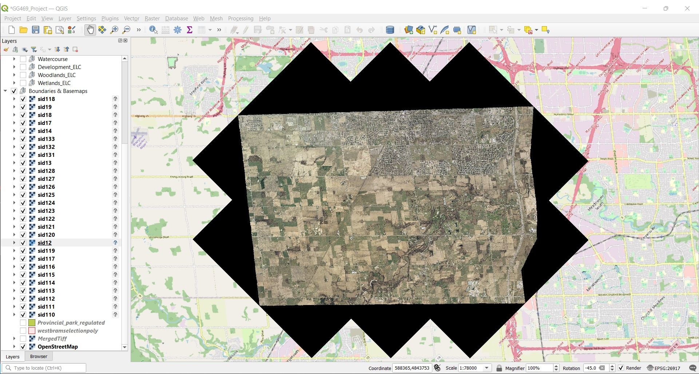
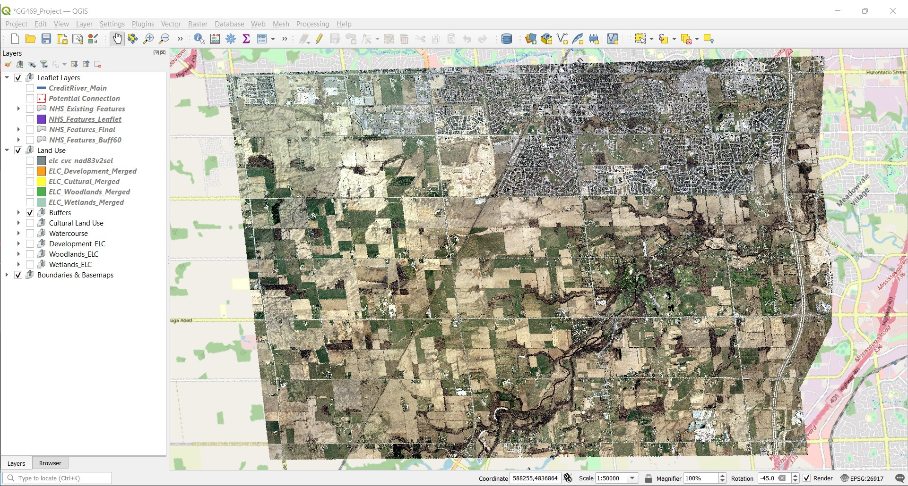
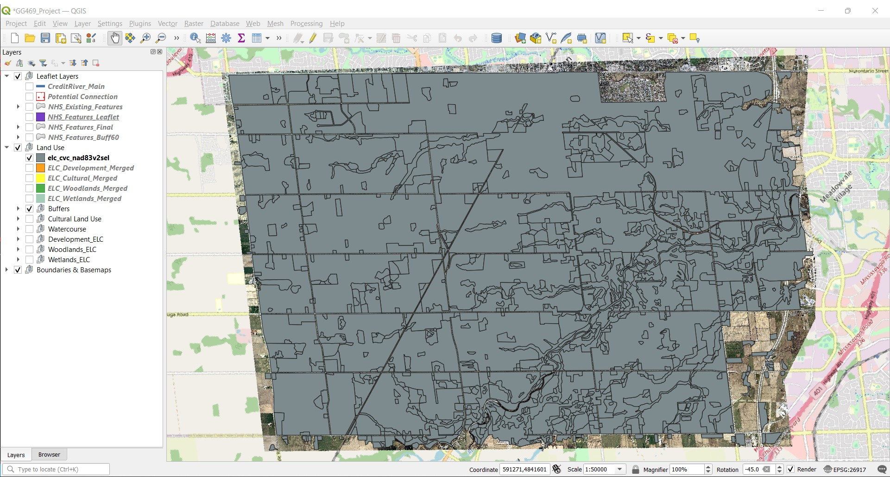
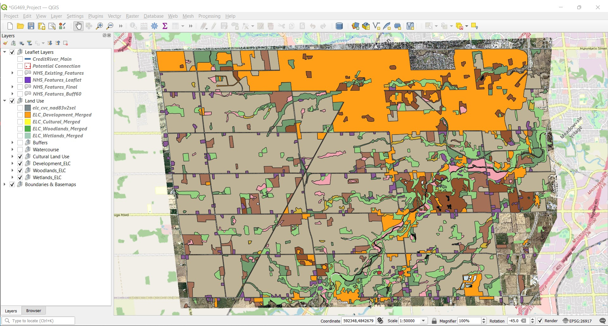
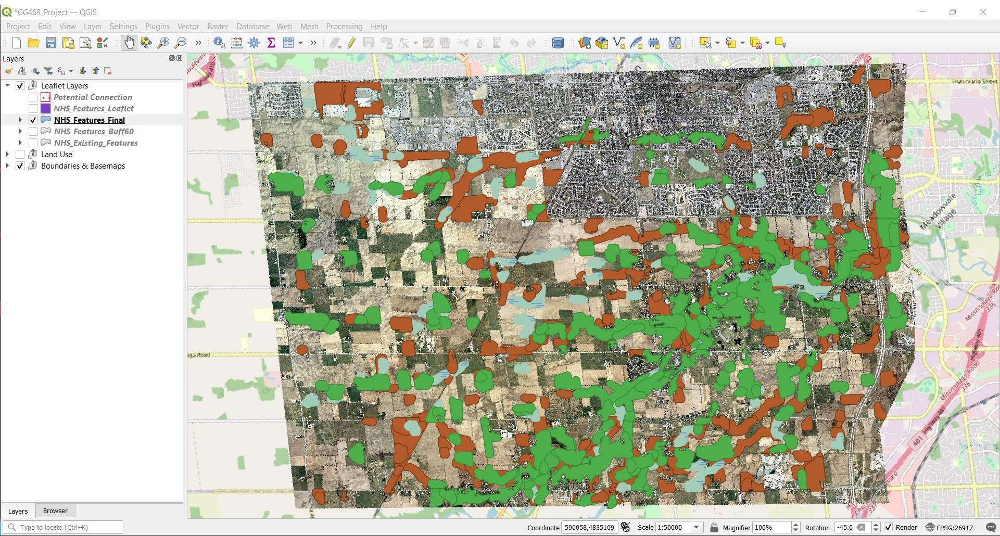
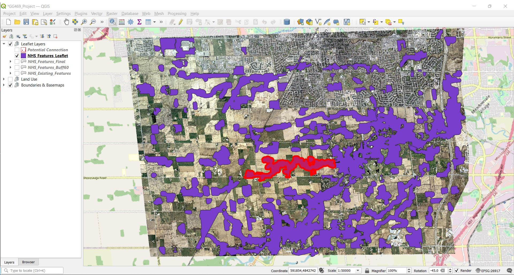

# Brampton Natural Heritage System (NHS) Mapping

**Project Description** - Our Team set out to re-design the Natural Heritage System (Greenland's System) for the City of Brampton, Ontario. The data used was from the year 1996, prior to the cities significant growth. The results are meant to show areas that could have potentially been naturalized had a more aggressive NHS been put in place at this time. We used *Forman, R.T.T. Some general principles of landscape and regional ecology. Landscape Ecology 10, 133–142 (1995)* as a primary source to understand the basic tenants of a good natural heritage system design. The finished product for this project is a Interactive Web Map using Leaflet.js. 

## Project Breakdown (Process)

**Data Acquisition and Analysis** - Reviewing all provided data and its metadata, and selecting additional, external data sets based on our discussions of project scope. 

**Creation of Study Area** - Course provided data included a file of 28 separate .TIF Landsat imagery files, each a square with an edge length of 2.5km and an area of 6.25km². When all layers were projected they form an area of approx. 175km², however each of the external images had a black "border". 

The border was removed by adding "0" to the No Data Value property for the layer, which did remove some pixels from within the map that had a value of "0" (aka. black), however it seamed a suitable workaround that did not adversely affect the final map outcome. The resulting image had an approx. area of 112km², and became the boundary for the remainder of the project. (See Before and after pictures)

**BEFORE** - With Borders.

**AFTER** - Without Borders.

**Separation of Land-use Features** - The primary layer used in this project was "elc_cvc_nad83v2sel", which mapped the Ecological Land Classification (ELC) of our study area, preformed by Credit Valley Conservation (CVC). Using the 'Split Vector Layer' tool, selecting for 'TYPE' we were able to create separate layers for all 23 types found within this layer. 

Due to the timeframe and relative scope of this project we were less concerned on the exact ELC type (eg. Coniferous Forest) and more on the overarching land use (eg. Forest), for this reason we then merged similar types. This left us with layers for "Woodlands", "Wetlands", "Cultural", "Developed", and "Agricultural". 

We then 'Clipped' the "Watercourse" layer we received from the Ont_GeoHub, then using the attributes table manually selected each segment of the Credit River and merged to create a single "CreditRiver_Main". We then used the 'Difference' tool on the "CreditRiver_Main" to separate all the tributaries branching from the main, saving and labeling them "CreditRiver_Tribs".

**BEFORE** - ELC Un-edited

**AFTER** - ELC Separated

**Determining Areas for NHS Growth** - With the objective of strengthening or enlarging the existing natural areas, we had to define where we could realistically expand. The conclusion was that agricultural lands were the most likely candidate for naturalizations and that any 'Urban' or 'Developed' area would be out of bounds. Using our groups research on best practices, we determined that expanding our existing natural areas by a 60 meter buffer would provide a significant increase in protection for most terrestrial and aquatic species likely found in this area. Buffers ranging from 20 meter to 120 meters were applied to the land uses types in varying combinations, but ultimately a consistent 60 meter buffer on all types seamed most pragmatic. We then removed any buffer area that fell within the "Developed" layer using the "difference" tool, ensuring our NHS would only grow into agricultural areas. (See "NHS_Feature")

**Formatting Layer for Leaflet** - The final portion of work done in QGIs was to optimize for dissemination, in this case interactive web mapping using [Leaflet.js](https://leafletjs.com/SlavaUkraini/). Our objective here was to create separate, selectable features for Core Area, Corridor Area and Steppingstone Areas. Using the 'NHS_Features_Final', we manually delineated each feature (which were comprised of the woodland, wetland, and cultural area buffers made earlier), creating separate shape files for each. This resulted in 100 shapefile layers, which were then merged into the single part layer 'NHS_Features_Leaflet', and saved in the projection WGS84 (EPSG:4326), the preferred projection for Leaflet. There appeared to be no effective way to automate the delineation of features as it was not based on attributes but rather by visual extend - which areas look like core vs corridor based on size and shape. (See image of "NHS_Features_Leaflet" with a feature selected.)

**Final Map**
Below is the link to the completed interactive project map.

[Brampton_NHS_WebMap]()

## Difficulties and Future improvement's
Although this project appears fairly straightforward, much of the difficulties, including trial and error, and repetitive tasks where not show. The following points are areas of difficulty or where improvement could be made either to the mapping itself or to the process in which we got there.
1. **Human Error** - As is to be expected, some errors were made in the analysis of this data, which could have been rectified but would require redoing much of the work. An example of this is the removal of segments within "Fletchers Creek" to the East of McLaughlin Rd. S. It's unclear when these segments were removed, and once discovered the project was to far along to correct the error without major time delays.
2. **Lack of Experience** - Although to be expected, as this project was completed as part of a university course, some time would have been saved, and results could have been better, had users been more familiar with the outcomes that various geoprocessing tools provided. As a result some trial and error (and googling) was required to determine the correct tool for a desired outcome and not all outcomes were achieved. An example of this is that the finished "NHS_Features_Leaflet" layer has not been clipped to the major road network of the city, as was done with the 'Developed Area'. Doing so would have provided a clearer understanding of where the NHS could and could not grow, but was unfortunately to complex process for the user to complete. 
3. **Multi-User Collaboration** - Although there are systems and methods for multiple users working simultaneous or in sync with each on a GIS based project, they are not as easily set up as, for example, a shared google doc file, but rather are made up of predefined and registered users collaboration over the long term. This meant that within our team, the majority of GIS analysis was completed by a single user, with Research, Report Writing, Presentation Development, and .R Code Development becoming the domain of the remaining team members. Although this was a less "collaborative" approach, it did allow each member to hyper focus on there own domain, which lead to fast and effective completion of the workload. 
4. **Lack of Public Data** - As with many project your scope is determined by the available data. Our team had initially thought to create two end maps, one should where we would expand the NHS in 1996 (which is what we did) AND where we could expand now in 2022 with development having occurred. The issue we were faced with was that we could not find an additional data source containing the same layers as the provided data for the current year (or any year in the 2000's). Data was available at cost from the Province of Ontario, but that was not an option for this project.